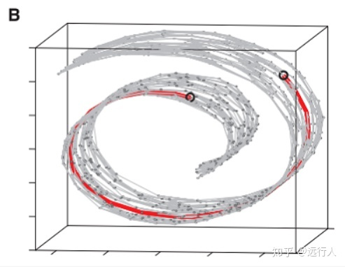
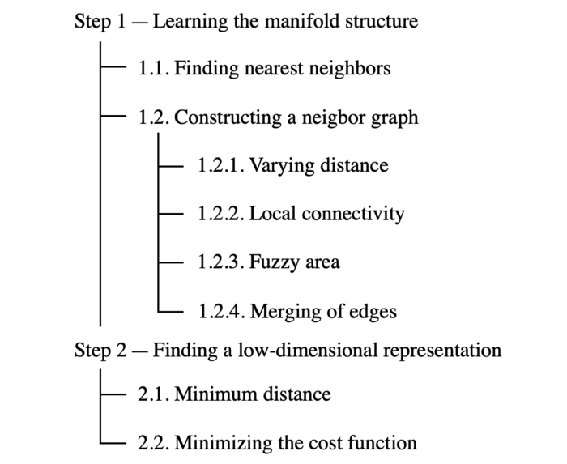
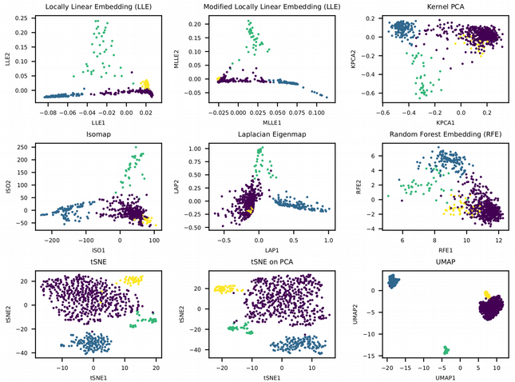

### Dimension reduction

[toc]

空间降维技术，首先是线性空间里的PCA，然后是非线性的kernel PCA。这里考虑的角度是把方差不大的维度扔掉，但是这样不能考虑到一些细微的空间结构是基于全局而非局部的方法，其度量函数仅针对欧式空间。所以我们可以引入ISOMAP的黎曼流形的方法。当然ISOMAP的引入其实和MDS更直接相关。当解决了局部空间度量后，我们还需要考虑我们所学习的这个空间的均布性，所以我们再次改进算法得到UMAP算法。

#### 1 PCA

Principal component analysis，我们可以看得到，就是要找出一个坐标轴来最大化方差，也就是 $max \sum(x)^2$。这个向量其实就是XTX的最大奇异值对应的向量。

[wiki](https://en.wikipedia.org/wiki/Principal_component_analysis)

##### First component

In order to maximize variance, the first weight vector $\mathbf{w}_{(1)}$ thus has to satisfy
$$
\mathbf{w}_{(1)}=\arg \max _{\|\mathbf{w}\|=1}\left\{\sum_{i}\left(t_{1}\right)_{(i)}^{2}\right\}=\arg \max _{\|\mathbf{w}\|=1}\left\{\sum_{i}\left(\mathbf{x}_{(i)} \cdot \mathbf{w}\right)^{2}\right\}
$$
Equivalently, writing this in matrix form gives
$$
\mathbf{w}_{(1)}=\arg \max _{\|\mathbf{w}\|=1}\left\{\|\mathbf{X} \mathbf{w}\|^{2}\right\}=\arg \max _{\|\mathbf{w}\|=1}\left\{\mathbf{w}^{\top} \mathbf{X}^{\top} \mathbf{X} \mathbf{w}\right\}
$$
Since $\mathbf{w}_{(1)}$ has been defined to be a unit vector, it equivalently also satisfies
$$
\mathbf{w}_{(1)}=\arg \max \left\{\frac{\mathbf{w}^{\top} \mathbf{X}^{\top} \mathbf{X} \mathbf{w}}{\mathbf{w}^{\top} \mathbf{w}}\right\}
$$
The quantity to be maximized can be recognized as a Rayleigh quotient. A standard result for a positive semidefinite matrix such as $\mathbf{X}^{\top} \mathbf{X}$ is that the quotient's maximum possible value is the largest eigenvalue of the matrix, which occurs when $w$ is the corresponding eigenvector.
With $\mathbf{w}_{(1)}$ found, the first principal component of a data vector $\mathbf{x}_{(i)}$ can then be given as a score $t_{1(i)}=\mathbf{x}_{(i)} \cdot \mathbf{w}_{(1)}$ in the transformed co-ordinates, or as the corresponding vector in the original variables, $\left\{\mathbf{x}_{(i)} \cdot \mathbf{w}_{(1)}\right\} \mathbf{w}_{(1)}$.

##### Further components

The $k$-th component can be found by subtracting the first $k-1$ principal components from $\mathbf{X}:$
$$
\hat{\mathbf{X}}_{k}=\mathbf{X}-\sum_{s=1}^{k-1} \mathbf{X} \mathbf{w}_{(s)} \mathbf{w}_{(s)}^{\top}
$$
and then finding the weight vector which extracts the maximum variance from this new data matrix
$$
\mathbf{w}_{(k)}=\underset{\|\mathbf{w}\|=1}{\arg \max }\left\{\left\|\hat{\mathbf{X}}_{k} \mathbf{w}\right\|^{2}\right\}=\arg \max \left\{\frac{\mathbf{w}^{\top} \hat{\mathbf{X}}_{k}^{\top} \hat{\mathbf{x}}_{k} \mathbf{w}}{\mathbf{w}^{T} \mathbf{w}}\right\}
$$
It turns out that this gives the remaining eigenvectors of $\mathbf{X}^{\top} \mathbf{X}$, with the maximum values for the quantity in brackets given by their corresponding eigenvalues. Thus the weight vectors are eigenvectors of $\mathbf{X}^{\top} \mathbf{X}$.
The $k$-th principal component of a data vector $\mathbf{x}_{(i)}$ can therefore be given as a score $t_{k(t)}=\mathbf{x}_{(i)} \cdot \mathbf{w}_{(k)}$ in the transformed coordinates, or as the corresponding vector in the space of the original variables, $\left\{\mathbf{x}_{(i)} \cdot \mathbf{w}_{(k)}\right\} \mathbf{w}_{(k)}$, where $\mathbf{w}_{(k)}$ is the $k$ th eigenvector of $\mathbf{X}^{\top} \mathbf{X} .$
The full principal components decomposition of $\boldsymbol{X}$ can therefore be given as
$$
\mathbf{T}=\mathbf{X W}
$$
where $\mathbf{W}$ is a $p$-by- $p$ matrix of weights whose columns are the eigenvectors of $\mathbf{X}^{\top} \mathbf{X}$. The transpose of $\mathbf{W}$ is sometimes called the whitening or sphering transformation. Columns of $\mathbf{W}$ multiplied by the square root of corresponding eigenvalues, that is, eigenvectors scaled up by the variances, are called loadings in PCA or in Factor analysis.

#### 2 MDS

[wiki](https://en.wikipedia.org/wiki/Multidimensional_scaling)

Multidimensional scaling (MDS) is a means of visualizing the level of similarity of individual cases of a dataset. MDS is used to translate "information about the pairwise 'distances' among a set of $n$ objects or individuals" into a configuration of $n$ points mapped into an abstract Cartesian space.

它就是把存在高维空间里的点都压缩到低维空间的同时保留点和点之间的 ‘距离’，这里的距离在经典MDS里是欧式的，后来被拓展到非欧式的。

> Steps of a Classical MDS algorithm
>
> Classical MDS uses the fact that the coordinate matrix $X$ can be derived by eigenvalue decomposition from $B=X X^{\prime}$. And the matrix $B$ can be computed from proximity matrix $D$ by using double centering.
>
> 1. Set up the squared proximity matrix $D^{(2)}=\left[d_{i j}^{2}\right]$，$d_{i j}=\sqrt{\left(x_{i}-x_{j}\right)^{2}+\left(y_{i}-y_{j}\right)^{2}}$
> 2. Apply double centering: $B=-\frac{1}{2} C D^{(2)} C$ using the centering matrix $C=I-\frac{1}{n} J_{n}$, where $n$ is the number of objects, $I$ is the $n \times n$ identity matrix, and $J_{n}$ is an $n \times n$ matrix of all ones.
> 3. Determine the $m$ largest eigenvalues $\lambda_{1}, \lambda_{2}, \ldots, \lambda_{m}$ and corresponding eigenvectors $e_{1}, e_{2}, \ldots, e_{m}$ of $B$ (where $m$ is the number of dimensions desired for the output).
> 4. Now, $X=E_{m} \Lambda_{m}^{1 / 2}$, where $E_{m}$ is the matrix of $m$ eigenvectors and $\Lambda_{m}$ is the diagonal matrix of $m$ eigenvalues of $B$.
>    Classical MDS assumes Euclidean distances. So this is not applicable for direct dissimilarity ratings.

上面直接给了方法，没有给推导，==不如看 [知乎](https://zhuanlan.zhihu.com/p/51441355) 这篇==。

##### 推导

给定 $N$ 个实例，每个实例是一个 $(1 \times m)$ 维的向量，我们可以计算出 $m$ 维空间中的距离矩 阵 $D ， D$ 是一个 $(N \times N)$ 矩阵；其中第 $i$ 行 $j$ 列的元素表示第 $i$
个实例和第 $j$ 个实例之间的距离。假设我们把数据降维至 $Z$ 维空间中，其中 $Z_{i}$
表示其中第 $i$ 个实例。

###### 利用内积形式推导(Classical MDS)

要求任意两个实例在Z维空间中的距离与原始空间的距离相同。因此我们有如下表达式:

$$
d_{i j}{ }^{2}=\left\|z_{i}-z_{j}\right\|^{2}=\left\|z_{i}\right\|^{2}+\left\|z_{j}\right\|^{2}-2 z_{i}^{T} z_{j}
$$

因为将在 $Z$ 维空间中空间中，点可以进行平移与旋转，因此在Z维空间中会有多种分布满足要 求，不失一般性，我们假设 $Z$ 维空间中的实例点是中心化的，即:
$$
\sum_{i=1}^{N} z_{i}=0		\tag{1}
$$
我们对公式 (1) 左右两边求和:
$$
\sum_{i=1}^{N} d_{i j}^{2}=\sum_{i=1}^{N}\left\|z_{i}\right\|^{2}+N\left\|z_{i}\right\|^{2} \tag{2} 
$$

$$
\sum_{j=1}^{N} d_{i j}^{2}=\sum_{j=1}^{N}\left\|z_{j}\right\|^{2}+N\left\|z_{j}\right\|^{2}	\tag{3}
$$
 对公式(3)两边再次进行求和:
$$
\sum_{i=1}^{N} \sum_{j=1}^{N} d_{i j}^{2}=\sum_{i=1}^{N} \sum_{j=1}^{N}\left\|z_{j}\right\|^{2}+N \sum_{i=1}^{N}\left\|z_{i}\right\|^{2}=2 N \sum_{i=1}^{N}\left\|z_{i}\right\|^{2} 	\tag{4}
$$
定义内积矩阵 $B=Z^{T} Z$ ，其中。将式(2)(3)(4)代入式(1)中，可得:
$$
b_{i j}=-\frac{1}{2}\left(\frac{1}{N^{2}} \sum_{i=1}^{N} \sum_{j=1}^{N} d_{i j}^{2}-\frac{1}{N} \sum_{i=1}^{N} d_{i j}^{2}-\frac{1}{N} \sum_{j=1}^{N} d_{i j}^{2}+d_{i j}^{2}\right) 	\tag{5}
$$
由于矩阵 $B$ 是一个是对称矩阵，因此对矩阵 $B$ 进行特征分解可以得到:
$$
B=V A V^{T} 
$$
其中， $\Lambda$ 是的特征值矩阵， $E$ 是特征向量矩阵。由于我们将数据降维到 $Z$ 维空间中，因此我 们选择前 $z$ 个最大的特征值以及特征向量。降维之后的数据点表示为
$$
Z=V_{z} \Lambda_{z}^{1 / 2}
$$

###### 构造损失函数求解(No-classical MDS\&\&classical MDS)

当距离标准不是欧式距离的时候，此时不存在解析解，需要采用优化算法的形式求解。我们的目标 是使数据点在高维和低维空间中的距离尽可能的相近，因此我们可以构造如下目标函数，通过最小化损失函数的值来求点在 $Z$ 维空间的分布:
$$
J=\frac{1}{N^{2}} \sum_{i=1}^{N} \sum_{j=i+1}^{N}\left(\left\|z_{i}-z_{j}\right\|-d_{i j}\right)^{2}
$$

#### 2 t-SNE

> **t-distributed stochastic neighbor embedding** (**t-SNE**) is a [statistical](https://en.wikipedia.org/wiki/Statistical) method for visualizing high-dimensional data by giving each datapoint a location in a two or three-dimensional map. 

t-SNE 也是一种典型的降维方法，目的在于data visualization。read [Wiki page, Details part](https://en.wikipedia.org/wiki/T-distributed_stochastic_neighbor_embedding)：

降维的统一思想是在低维空间里保留高维空间点和点之间的“距离”，在t-SNE里用的距离是（高斯）概率。

原始**高维空间** - 首先我们定义以i点为中心，对应 j 数据点的条件概率计算公式为：
$$
\begin{equation}
p_{j \mid i}=\frac{\exp \left(-\left\|\mathbf{x}_{i}-\mathbf{x}_{j}\right\|^{2} / 2 \sigma_{i}^{2}\right)}{\sum_{k \neq i} \exp \left(-\left\|\mathbf{x}_{i}-\mathbf{x}_{k}\right\|^{2} / 2 \sigma_{i}^{2}\right)}
\end{equation}
$$
然后定义 (i,j) 点的联合概率为：
$$
p_{i j}=\frac{p_{j \mid i}+p_{i \mid j}}{2 N}
$$
This is motivated because $p_i$ and $p_j$ from the $\mathrm{N}$ samples are estimated as $1 / \mathrm{N}$, so the conditional probability can be written as $p_{i \mid j}=N p_{i j}$ and $p_{j \mid i}=N p_{j i}$. Since $p_{i j}=p_{j i}$, you can obtain previous formula.

Also note that $p_{i i}=0$ and $\sum_{i, j} p_{i j}=1$

**降维空间**里的概率分布我们选了一个dof=1的胖尾student t dist.模型（等价于柯西分布模型）定义为q分布：
$$
\begin{equation}
q_{i j}=\frac{\left(1+\left\|\mathbf{y}_{i}-\mathbf{y}_{j}\right\|^{2}\right)^{-1}}{\sum_{k} \sum_{l \neq k}\left(1+\left\|\mathbf{y}_{k}-\mathbf{y}_{l}\right\|^{2}\right)^{-1}}
\end{equation}
$$
**优化目标**：拉近高低维空间里的分布距离，或者说保留高维空间里的度量。建模为 最小化p和q的KL divergence，用梯度下降优化。
$$
\begin{equation}
\mathrm{KL}(P \| Q)=\sum_{i \neq j} p_{i j} \log \frac{p_{i j}}{q_{i j}}
\end{equation}
$$

MINST 数据的t-SNE效果

#### 3 ISOMAP

[wiki](https://en.wikipedia.org/wiki/Isomap )   [知乎](https://zhuanlan.zhihu.com/p/60599491)

The algorithm provides a simple method for estimating the intrinsic geometry of a data [manifold](https://en.wikipedia.org/wiki/Manifold) based on a rough estimate of each data point’s neighbors on the manifold. Isomap 是MDS的一个自然延伸，它的方法里，样本点间的相似度/度量方式不再是欧式的，而是在流形上的距离。流形的构造方式是nearest-neighbour。

所以它和下面的UMAP都是两步走：第一步通过最近邻算法来构造近似流形图，然后再把点压缩映射到流形上。只不过UMAP里做了uniform distribution的假设。

##### high-level Algorithm

A very high-level description of **Isomap** algorithm is given below.

- Determine the neighbors of each point.
  - All points in some fixed radius.
  - *K* nearest neighbors.
- Construct a neighborhood graph.
  - Each point is connected to other if it is a *K* nearest neighbor.
  - Edge length equal to Euclidean distance.
- Compute shortest path between two nodes.
  - [Dijkstra's algorithm](https://en.wikipedia.org/wiki/Dijkstra's_algorithm)
  - [Floyd–Warshall algorithm](https://en.wikipedia.org/wiki/Floyd–Warshall_algorithm)
- Compute lower-dimensional embedding.
  - [Multidimensional scaling](https://en.wikipedia.org/wiki/Multidimensional_scaling)

Isomap的经典三张图：

虚线是euclidean distance，但是它在数据的流形结构上是不成立的，所以我们要找的度量方式是geodesic的距离也就是图二，具体计算最短距离的方式就是近邻图上的最短路径了。

#### 4 UMAP

最后终于来到了流行的前沿 - UMAP，该算法在

[原版](https://towardsdatascience.com/umap-dimensionality-reduction-an-incredibly-robust-machine-learning-algorithm-b5acb01de568)  [中文版](https://zhuanlan.zhihu.com/p/432805218)

- **Projection** — the process or technique of reproducing a spatial object upon a plane, a curved surface, or a line by projecting its points. You can also think of it as a mapping of an object from high-dimensional to low-dimensional space.
- **Approximation** — the algorithm assumes that we only have a finite set of data samples (points), not the entire set that makes up the manifold. Hence, we need to approximate the manifold based on the data available.
- **Manifold** — a manifold is a topological space that locally resembles Euclidean space near each point. One-dimensional manifolds include lines and circles, but not figure eights. Two-dimensional manifolds (a.k.a. surfaces) include planes, spheres, torus, and more.
- **Uniform** — the uniformity assumption tells us that our data samples are uniformly (evenly) distributed across the manifold. In the real world, however, this is rarely the case. Hence, this assumption leads to the notion that the distance varies across the manifold. i.e., the space itself is warping: stretching or shrinking according to where the data appear sparser or denser.

*A dimensionality reduction technique that assumes the available data samples are evenly (***uniformly***) distributed across a topological space (***manifold***), which can be* **approximated** *from these finite data samples and mapped (***projected***) to a lower-dimensional space.*

##### High-level steps

We can split UMAP into two major steps:

1. learning the manifold structure in the high-dimensional space;
2. finding a low-dimensional representation of said manifold.

We will, however, break this down into even smaller components to make our understanding of the algorithm deeper. The below map shows the order that we will go through in analyzing each piece.

###### Step 1 — Learning the manifold structure

It will come as no surprise, but before we can map our data to lower dimensions, we first need to figure out what it looks like in the higher-dimensional space.

**1.1. Finding nearest neighbors**
UMAP starts by finding the nearest neighbors using the [Nearest-Neighbor-Descent algorithm of Dong et al](http://www.cs.princeton.edu/cass/papers/www11.pdf). You will see in the Python section later on that we can specify how many nearest neighbors we want to use by adjusting UMAP’s ***n_neighbors\*** hyperparameter.

It is important to experiment with the number of ***n_neighbors\*** because it **controls how UMAP balances local versus global structure in the data**. It does it by constraining the size of the local neighborhood when attempting to learn the manifold structure.

Essentially, a small value for ***n_neighbors\*** means that we want a very local interpretation that accurately captures the fine detail of the structure. In contrast, a large ***n_neighbors\*** value means that our estimates will be based on larger regions, thus more broadly accurate across the manifold as a whole.

**1.2. Constructing a graph**
Next, UMAP needs to construct a graph by connecting the previously identified nearest neighbors. To understand this process, we need to look at a few sub-components that explain how the neighborhood graph comes to be.

**1.2.1. Varying distance**
As outlined in the analysis of the UMAP’s name, we assume a uniform distribution of points across the manifold, suggesting that space between them is stretching or shrinking according to where the data appears to be sparser or denser.

It essentially means that the distance metric is not universal across the whole space, and instead, it varies between different regions. We can visualize it by drawing circles/spheres around each data point, which appear to be different in size because of the varying distance metric (see illustration below).

Local connectivity and fuzzy open sets. Image source: [UMAP documentation](https://umap-learn.readthedocs.io/en/latest/how_umap_works.html).

**1.2.2. Local connectivity**
Next, we want to ensure that the manifold structure we are trying to learn does not result in many unconnected points. Luckily, we can use another hyperparameter called ***local_connectivity\*** (default value = 1) to solve this potential problem.

When we set ***local_connectivity=1,\*** we tell the algorithm that every point in the higher-dimensional space is connected to at least one other point. You can see in the above illustration how each solid circle touches at least one data point.

**1.2.3. Fuzzy area**
You must have noticed that the illustration above also contains fuzzy circles extending beyond the closest neighbor. This tells us that the certainty of connection with other points decreases as we get farther away from the point of interest.

The easiest way to think about it is by viewing the two hyperparameters (***local_connectivity\*** and ***n_neighbors\***) as lower and upper bounds:

- **local_connectivity (default=1)** — there is 100% certainty that each point is connected to at least one other point (lower limit for a number of connections).
- **n_neighbors (default=15)** — there is a 0% chance that a point is directly connected to a 16th+ neighbor since it falls outside the local area used by UMAP when constructing a graph.
- **neighbors 2 to 15** — there is some level of certainty (>0% but <100%) that a point is connected to its 2nd to 15th neighbor.

**1.2.4. Merging of edges**
Finally, we need to understand that the connection certainty discussed above is expressed through edge weights (***w\***).

Since we have employed a varying distance approach, we will unavoidably have cases where edge weights do not align when viewed from the perspective of each point. E.g., the edge weight for points A→ B will be different from the edge weight of B→ A.

UMAP overcomes the problem of disagreeing edge weights we just described by taking a union of the two edges. Here is how [UMAP documentation](https://umap-learn.readthedocs.io/en/latest/how_umap_works.html) explains it:

> If we want to merge together two disagreeing edges with weight *a* and *b* then we should have a single edge with combined weight 𝑎+𝑏−𝑎⋅𝑏. The way to think of this is that the weights are effectively the probabilities that an edge (1-simplex) exists. The combined weight is then the probability that at least one of the edges exists.

In the end, we get a connected neighborhood graph that looks like this:

*Graph with combined edge weights.*Image source: [UMAP documentation](https://umap-learn.readthedocs.io/en/latest/how_umap_works.html).

###### Step 2 — Finding a low-dimensional representation

After learning the approximate manifold from the higher-dimensional space, the next step for UMAP is to project it (map it) to a lower-dimensional space.

**2.1. Minimum distance
**Unlike the first step, we do not want varying distances in the lower-dimensional space representation. Instead, we want the distance on the manifold to be standard Euclidean distance with respect to the global coordinate system.

The switch from varying to standard distances also impacts the proximity to nearest neighbors. Hence, we must pass another hyperparameter called ***min_dist\*** *(default=0.1)* to define the minimum distance between embedded points.

Essentially, we can control the minimum spread of points, avoiding scenarios with many points sitting on top of each other in the lower-dimensional embedding.

**2.2. Minimizing the cost function (Cross-Entropy)
**With the minimum distance specified, the algorithm can start looking for a good low-dimensional manifold representation. UMAP does it by minimizing the following cost function, also known as Cross-Entropy (CE):

As you can see, the ultimate goal is to **find the optimal weights of edges in the low-dimensional representation**. These optimal weights emerge as the above Cross-Entropy cost function is minimized following an iterative stochastic gradient descent process.

And that is it! The UMAP’s job is now complete, and we are given an array containing the coordinates of each data point in a specified lower-dimensional space.

#### 5 Laplacian Eigenmaps

##### 引入 Laplacian matrix

首先我们要对Laplacian matrix有一个概念。

我们一般使用 $G(V, E)$ 表示一个图，其中 $V$ 表示图中的顶点 $\left\{v_{1}, v_{2}, \ldots \ldots, v_{n}\right\}  \in \mathbb{R}^{l}， E$ 表示顶点和顶点之间的边。定义 $w_{i j}$ 为顶点 $v_{i}$ 和 $v_{j}$ 之间的权重。对于一个有 $n$ 个节点 的图，可以得到一个大小为 $(n, n)$ 的权重矩阵 $W$ 。根据图中度的定义，我们可以得到图的 度矩阵 $D ， D$ 是一个对角矩阵，其中 $d_{i i}$ 表示顶点 $v_{i}$ 的度。其中：
$$
d_{i i}=\sum_{j} w_{i j}
$$
然后拉普拉斯矩阵就是 L = D - W。它的一个有用的公式为：
$$
f^{t} L f=\frac{1}{2}\left(\sum_{i} f_{i}^{2} D i i+\sum_{i} f_{j}^{2} D j j-2 \sum_{i j} f_{i} f_{j} w_{i j}\right)=\frac{1}{2}\left(\sum_{i j}\left(f_{i}^{2}+f_{j}^{2}-2 f_{i} f_{j}\right) w_{i j}\right)=\frac{1}{2} \sum_{i j}\left(f_{i}-f_{j}\right) w_{i j}	\tag 1
$$

##### LE算法

LE算法是一种保留数据局部特征的流形降维算法。其主要思想是在低维空间内尽可能保留数据局部羘本点之间的结构不变。假设原始数据集为 $X=x_{1}, x_{2}, \ldots \ldots x_{n} \in R^{m}$ ，为一个 $(n, m)$ 的数据集。

###### 1 高维空间样本结构描述

在高维空间使用构建 k近邻图 的方法来描述局部样本点之间的结构。对于样本点 $x_{i}$, 如果样本 点 $x_{j}$ 于其互为近邻，则有:
$$
w_{i j}=\exp ^{-\left\|x_{i}-x_{j}\right\|^{2} / t}
$$
其中 $t$ 是一个自己指定的常数。如果 $x_{l}$ 不是其近邻，则
$$
w_{i l}=0
$$
最后得到的 $W$ 矩阵就是高维空间样本点的结构矩阵。由于这个结构矩阵只存放每个点和其 k近邻点的结构关系，(不是K近邻的点，权重值通通为 0 )，所以LE算法只能保留数据的局部结构。

###### 2 低维空间样本保留结构

我们设降维之后的矩阵为 $Y=y_{1}, y_{2}, \ldots \ldots y_{n} \in \mathbb{R}^{m}$ ，是一个 $(n, m)$ 的数据集（其中m是降维后的维度，n是数据点的个数），为了在低维空间中也保留高维的结构性，我们可以定义如下的目标函数：
$$
\sum_{i j}\left(y_{i}-y_{j}\right)^{2} w_{i j}
$$
上述函数的表示如果在高维空间中两点距离越近，则在低维空间中两点的距离也越近，这样可以在低维空间尽可能的保留高维空间样本点的结构。根据拉普拉斯矩阵的性质可得 :
$$
\sum_{i j}\left(y_{i}-y_{j}\right)^{2} w_{i j}=\operatorname{tr}\left(2 Y^{T} L Y\right)
$$
为了消除低维空间中的缩放因子，也为了保证 $d_{i i}$ 值较大的样本点在低维空间中更为重要， 添加如下限制条件 :
$$
Y^{T} D Y=I
$$

###### 3 优化目标

$$
\arg \min _{Y} tr(Y^{T} L Y) \\
Y^{T} D Y=I
$$

此时通过lagrange multiplier可以将优化目标函数问题转换成为了广义特征值分解问题 （为了简化问题，下面这里我们假定Y是1维的，也就是 m=1，Y=nxm）:
$$
A=y^TLy - \lambda(y^TDy-1)  \Rightarrow\\
\frac{\partial A}{\partial y}=Ly=\lambda Dy=0 \Rightarrow\\
L y=\lambda D y \Rightarrow D^{-1} L y=\lambda y
$$
因此我们对矩阵 $D^{-1} L$ 进行特征值分解，取其第 2 小到第 $\mathrm{m}$ 小特征值所对应的特征向量即为所求的降维后的 $\boldsymbol{Y}$ 。(因为这里假设m=1，所以最后解就是y=第二小的eigenvalue对应的eigen vector)。

LE的算法流程如下:

1. 设置k值，构建k-近邻图 ; 计算获得权重矩阵 $\boldsymbol{W}$ 和度矩阵 $\boldsymbol{D}$ 。
2. 对矩阵 $\boldsymbol{D}^{-1} \boldsymbol{L}$ 进行特征值分解，从第二小开始取m个特征值对应的特征向量组成的降维之后的 $\boldsymbol{Y}$ 。

##### 讨论

上述描述里需要讨论的有两点：

1. 为什么我们要最小化 $\sum_{i j}\left(y_{i}-y_{j}\right)^{2} w_{i j}$ ?
2. $Y^{T} D Y=I$ 怎么就能消除低维空间的缩放因子？
3. 为什么要从第2小的eigenvalue对应的eigen vector选起？

对于这三个问题，在作者的[原论文](https://www2.imm.dtu.dk/projects/manifold/Papers/Laplacian.pdf)里都有很好的描述。总结如下：

1. ojb func.的设计保证如果k近邻的Y选的不够近，loss就会很高：The objective function with our choice of weights $W_{i j}$ incurs a heavy penalty if neighboring points $\mathbf{x}_{i}$ and $\mathbf{x}_{j}$ are mapped far apart. Therefore, minimizing it is an attempt to ensure that if $\mathbf{x}_{i}$ and $\mathbf{x}_{j}$ are "close," then $y_{i}$ and $y_{j}$ are close as well. 

2. 首先，论文的算法是从1维的y引入的y=(y0,y1,y2...)，这段话的意思直觉上来看就是首先通过这个约束我们可以把所有y的scaling的问题解决（否则要minimize问题我们只需要让所有y都映射到无限接近0不就好了嘛），其次y越重要它加权的权重越大，那我们就越可能把它放在低纬空间里比较靠近中心的位置。 The constraint $\mathbf{y}^{T} D \mathbf{y}=1$ removes an arbitrary scaling factor in the embedding. Matrix $D$ provides a natural measure on the vertices of the graph. The bigger the value $D_{i i}$ (corresponding to the $i$ th vertex) is, the more "important" is that vertex.

   然后对于m维度的问题上述约束就变成了$Y^{T} D Y=I$，拆开来看，发现我们不仅要求y自己的加权variance要固定为1，还要求不同y的covariance也要等于0. 这也是为了保证所有点不会collapse。如果是1维的，没有这个条件的话所有点会collapse到 (1,1,1,1,1,1...)，见第三点。

3. 因为D^-1^L是半正定矩阵（可证明不过也可以举个特例：y=1）所以它的最小eigenvalue一定是0，但是这样所有的n个点就都collapse到1个点上了，没有意义。 Let $\mathbf{1}$ be the constant function taking 1 at each vertex. It is easy to see that $\mathbf{1}$ is an eigenvector with eigenvalue 0 . If the graph is connected, 1 is the only eigenvector for $\lambda=0$. To eliminate this trivial solution, which collapses all vertices of $G$ onto the real number 1 , we put an additional constraint of orthogonality and look for
   $$
   \mathbf{y}^{T} D \mathbf{1}=0
   $$

	Thus, the solution is now given by the eigenvector with the smallest nonzero eigenvalue. The condition $\mathbf{y}^{T} D \mathbf{1}=0$ can be interpreted as removing a translation invariance in $\mathbf{y}$. 或者说我们不允许y和 $\mathbf{1}$ 之间有covariance。

#### 6 LLE

local linear embedding，也属于流形学习。它的embedding是局部线性的，对比上面的LE，它的distance measure不是exp，而是线性加权。所以相对简单些，例如：$x_{1}=w_{12} x_{2}+w_{13} x_{3}+w_{14} x_{4}$

老样子，我们先构建出knn graph，然后通过minimize下式来获得W的权重（总共m个样本点，k个权重，对于任意样本点i，k个权重的sum都要为1）：
$$
\mathcal{E}(W)=\sum_{i}\left|\vec{X}_{i}-\sum_{j} W_{i j} \vec{X}_{j}\right|^{2}\\
s.t. \sum_{j} w_{i j}=W_{i}^{T} 1_{k}=1 \tag1
$$
接着把高维空间的X压缩到低维空间Y里去，通过minimize下式来获得Y：
$$
\Phi(Y)=\sum_{i}\left|\vec{Y}_{i}-\sum_{j} W_{i j} \vec{Y}_{j}\right|^{2}		\tag2
$$

##### 求解

###### 公式1

$$
\begin{aligned}
J(W) &=\sum_{i=1}^{m}\left\|x_{i}-\sum_{j \in Q(i)} w_{i j} x_{j}\right\|_{2}^{2} \\
&=\sum_{i=1}^{m}\left\|\sum_{j \in Q(i)} w_{i j} x_{i}-\sum_{j \in Q(i)} w_{i j} x_{j}\right\|_{2}^{2} \\
&=\sum_{i=1}^{m}\left\|\sum_{j \in Q(i)} w_{i j}\left(x_{i}-x_{j}\right)\right\|_{2}^{2} \\
&=\sum_{i=1}^{m} W_{i}^{T}\left(X_{i}-X_{k}\right)\left(X_{i}-X_{k}\right)^{T} W_{i}
\end{aligned}
$$

令矩阵 $Z_{i}=\left(X_{i}-X_{k}\right)\left(X_{i}-X_{k}\right)^{T}$，其中$X_{i}$ 为kxd的矩阵（把xi在0维上复制k遍）， $X_{k}$ 为kxd的矩阵（xi的k个近邻），引入lagrange multiplier：
$$
L(W)=\sum_{i=1}^{m} W_{i}^{T} Z_{i} W_{i}+\lambda\left(W_{i}^{T} 1_{k}-1\right) \\
\frac{\partial L}{\partial W_i} = 2 Z_{i} W_{i}+\lambda 1_{k}=0 \\
W_{i}=\lambda^{\prime} Z_{i}^{-1} 1_{k}
$$
其中 $\lambda^{\prime}=-\frac{1}{2} \lambda$ 为一个常数。利用 $W_{i}^{T} 1_{k}=1$, 对 $W_{i}$ 归一化，那么最终我们的权重系数 $W_{i}$ 为:
$$
W_{i}=\frac{Z_{i}^{-1} 1_{k}}{1_{k}^{T} Z_{i}^{-1} 1_{k}}
$$

###### 公式2

为了使得有唯一可行解，我们添加两个约束条件（一个是中心化，一个是归一化）
$$
J(y)=\sum_{i=1}^{m}\left\|y_{i}-\sum_{j=1}^{m} w_{i j} y_{j}\right\|_{2}^{2}\\
s.t. \sum_{i=1}^{m} y_{i}=0 ; \quad \frac{1}{m} \sum_{i=1}^{m} y_{i} y_{i}^{T}=I
$$
接着将目标函数矩阵化：
$$
\begin{aligned}
J(Y) &=\sum_{i=1}^{m}\left\|y_{i}-\sum_{j=1}^{m} w_{i j} y_{j}\right\|_{2}^{2} \\
&=\sum_{i=1}^{m}\left\|Y I_{i}-Y W_{i}\right\|_{2}^{2} \\
&=\operatorname{tr}\left(Y(I-W)(I-W)^{T} Y^{T}\right)
\end{aligned}
$$
其中，W为mxm矩阵，它是对公式1结果的展开，对于每 [:,i] 维，有k个近邻为非零值。

我们令 $M=(I-W)(I-W)^{T}$, 则优化函数转变为最小化下式: $J(Y)=\operatorname{tr}\left(Y M Y^{T}\right)$。约束函数矩阵化为: $Y Y^{T}=m I$。引入lagrange multiplier：
$$
L(Y)=\operatorname{tr}\left(Y M Y^{T}+\lambda\left(Y Y^{T}-m I\right)\right)\\
$$
对 $Y$ 求导并令其为 0 ，我们得到 $2 M Y^{T}+2 \lambda Y^{T}=0$,即 $M Y^{T}=\lambda^{\prime} Y^{T}$, 这样我们就很清楚了，要得到最小的 $\mathrm{d}$ 维数据集，我们需要求出矩阵 $\mathrm{M}$ 最小 的d个特征值所对应的 $\mathrm{d}$ 个特征向量组成的矩阵 $Y=\left(y_{1}, y_{2}, \ldots y_{d}\right)^{T}$ 即可。但是与LE算法同样的原因，我们不能取λ=0时候的特征向量。所以就是最后取的Y就是第2小到第d+1小的特征向量的拼接。

##### 效果

算法步骤：

1. Compute the neighbors of each data point, $\vec{X}_{i}$.
2. Compute the weights $W_{i j}$ that best reconstruct each data point $\vec{X}_{i}$ from its neighbors, minimizing the cost in eq. (1) by constrained linear fits.
3. Compute the vectors $\vec{Y}_{i}$ best reconstructed by the weights $W_{i j}$, minimizing the quadratic form in eq. (2) by its bottom nonzero eigenvectors.

对比PCA效果还是很明显的：

具体可以去看文件夹里的[论文](https://cs.nyu.edu/~roweis/lle/papers/lleintro.pdf)和博客。

## 附录

1. 上述降维算法都是无监督的方法，当我们要对带标签的数据进行降维时，应该选择LDA（Linear Discriminant Analysis  ）[线性判别分析](https://zhuanlan.zhihu.com/p/51769969)算法（文件夹里有笔记）

2. 对比各种算法：

   https://towardsdatascience.com/reduce-dimensions-for-single-cell-4224778a2d67：In this post, we have learnt that single cell genomics data have a **non-linear structure** which comes from the large proportion of **stochastic zeros** in the expression matrix due to the drop out effect. The **linear manifold learning** techniques preserve the **global structure** of the data and are not capable of fully resolving all cell populations present. In contrast, **preserving the** **local connectivity between the data points (LLE, tSNE, UMAP)** is the key factor for a successful dimensionality reduction of single cell genomics data.
   
   
   
   
   
   
   
   

3. 非线性降维，通常最佳应用场景还是在可视化，对比非线性降维后再接线性分类或回归不如直接接一个非线性的分类/回归器。特别是t-SNE，算法复杂度比较高：https://www.zhihu.com/question/52022955/answer/387753267
